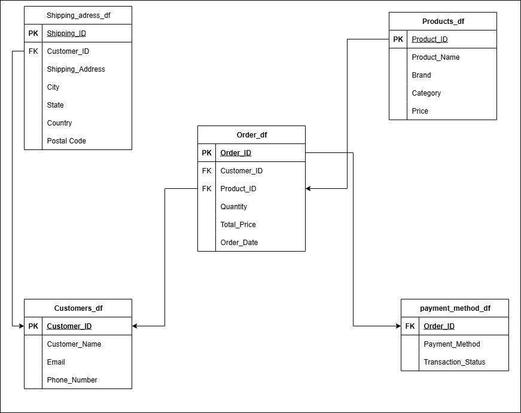

````markdown
# 🛒 Yanki E-Commerce ETL Project

## 📘 Overview
The **Yanki E-Commerce ETL Project** demonstrates a complete **Extract, Transform, Load (ETL)** workflow using a simulated online retail dataset.  
The goal is to clean, normalize, and structure raw transactional data into relational tables suitable for analysis, reporting, or database storage.

This project applies **data engineering principles** such as schema design, data cleaning, and data transformation, and produces multiple normalized tables connected via primary and foreign keys.

---

## 🧠 Objectives
- Extract raw e-commerce data from CSV files  
- Transform the data by cleaning, type conversion, and normalization  
- Load the cleaned data into separate structured tables  
- Build an ER (Entity-Relationship) diagram to visualize table relationships  

---

## 📊 ER Diagram



### Relationships
- Each **Customer** can place multiple **Orders**  
- Each **Order** can include multiple **Products**  
- Each **Order** has one **Payment Method**  
- Each **Customer** has one **Shipping Address**

---

## ⚙️ ETL Workflow

### 1. 🧩 Importing Libraries
Essential Python libraries were imported for data manipulation and analysis:
```python
import numpy as np
import pandas as pd
````

---

### 2. 🏗️ Extraction Layer

The raw dataset `yanki_ecommerce.csv` was loaded from the `rawdata` directory:

```python
yanki_df = pd.read_csv(r'C:\...\dataset\rawdata\yanki_ecommerce.csv')
```

Basic checks included:

* `head()` to preview data
* `info()` to inspect structure and datatypes
* `columns` to confirm field names

---

### 3. 🧹 Transformation Layer

#### 🧾 Data Cleaning

* Dropped rows with missing `Order_ID` or `Customer_ID`:

  ```python
  yanki_df.dropna(subset=['Order_ID', 'Customer_ID'], inplace=True)
  ```
* Removed records with missing `State` values.
* Converted the `Order_Date` column from string to datetime:

  ```python
  yanki_df['Order_Date'] = pd.to_datetime(yanki_df['Order_Date'], dayfirst=True)
  ```

#### 🧱 Table Normalization

The raw data was split into **dimension** and **fact** tables to reduce redundancy:

| Table                 | Description            | Key Columns                                                                      |
| --------------------- | ---------------------- | -------------------------------------------------------------------------------- |
| `customers_df`        | Customer info          | `Customer_ID`, `Customer_Name`, `Email`, `Phone_Number`                          |
| `products_df`         | Product details        | `Product_ID`, `Product_Name`, `Brand`, `Category`, `Price`                       |
| `shipping_address_df` | Customer shipping data | `Shipping_ID`, `Customer_ID`, `City`, `State`, `Country`, `Postal_Code`          |
| `orders_df`           | Transactional data     | `Order_ID`, `Customer_ID`, `Product_ID`, `Quantity`, `Total_Price`, `Order_Date` |
| `payment_method_df`   | Payment records        | `Order_ID`, `Payment_Method`, `Transaction_Status`                               |

Each table was created using filtered column selections and `drop_duplicates()` for uniqueness:

```python
customer_df = yanki_df[['Customer_ID', 'Customer_Name', 'Email', 'Phone_Number']].copy().drop_duplicates()
```

Shipping addresses were assigned a unique index:

```python
shipping_address_df.index.name = 'Shipping_ID'
shipping_address_df = shipping_address_df.reset_index()
```

---

### 4. 💾 Loading Layer

All cleaned tables were exported as separate CSV files to the `cleandata` directory:

```python
customer_df.to_csv('dataset/cleandata/customers.csv', index=False)
products_df.to_csv('dataset/cleandata/products.csv', index=False)
orders_df.to_csv('dataset/cleandata/orders.csv', index=False)
payment_method_df.to_csv('dataset/cleandata/payment.csv', index=False)
shipping_address_df.to_csv('dataset/cleandata/shipping.csv', index=False)
```

---

## ✅ Results

After the ETL process:

* The data was fully cleaned and normalized.
* Each table has unique primary keys and defined foreign key relationships.
* The final schema follows **third normal form (3NF)**.
* Clean CSV files are ready for database loading or business analytics.

---

## 🧰 Tools & Technologies

* 🐍 **Python 3**
* 🧮 **Pandas**, **NumPy**
* 📓 **Jupyter Notebook**
* 🗄️ **CSV File Storage**
* 🧱 **Relational Data Modeling**

---

## 🚀 Future Enhancements

* Automate the ETL process using **Airflow** or **Prefect**
* Load the final tables into a **SQL database** (e.g., PostgreSQL)
* Build dashboards using **Power BI** or **Tableau**
* Extend model with additional entities like inventory or suppliers

---

## 📁 Project Structure

```
Yanki_Ecommerce_ETL/
│
├── dataset/
│   ├── rawdata/
│   │   └── yanki_ecommerce.csv
│   └── cleandata/
│       ├── customers.csv
│       ├── products.csv
│       ├── orders.csv
│       ├── payment.csv
│       └── shipping.csv
│
├── yanki_etl.ipynb             # Main ETL notebook
├── Data_Model.png              # ER diagram
└── README.md                   # Documentation (this file)
```

---

## ✨ Author

**Kenneth Chizaram Mbadugha**
Data Engineer
📧 [mbadughakenneth2021@gmail.com](mailto:mbadughakenneth2021@gmail.com)


```

---

Would you like me to include a **“Setup Instructions”** section (to explain how someone can rerun your ETL notebook on their computer)? It’s great for collaborators or portfolio reviewers.
```
